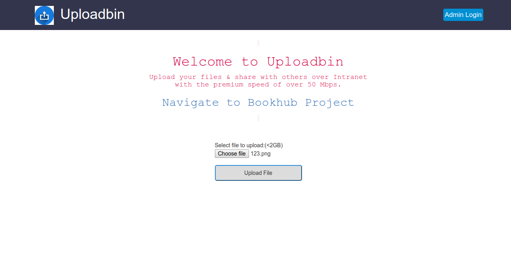
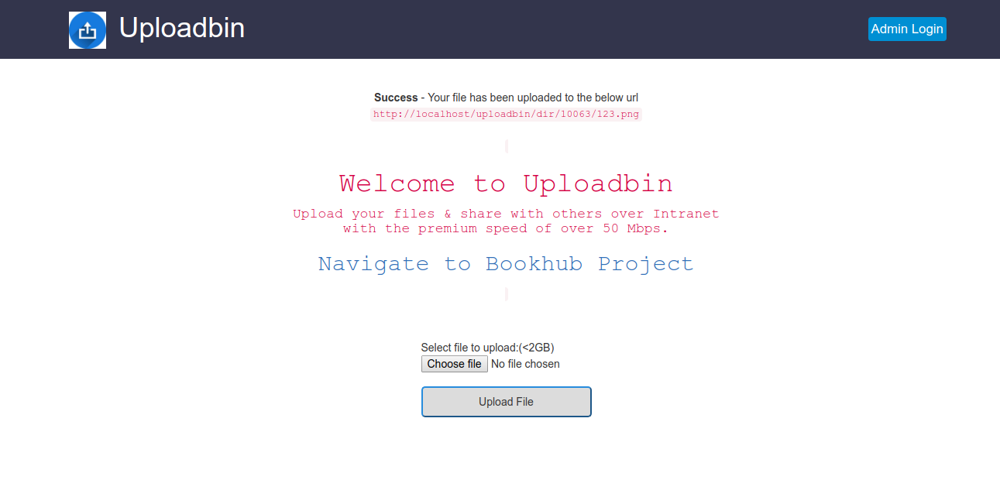
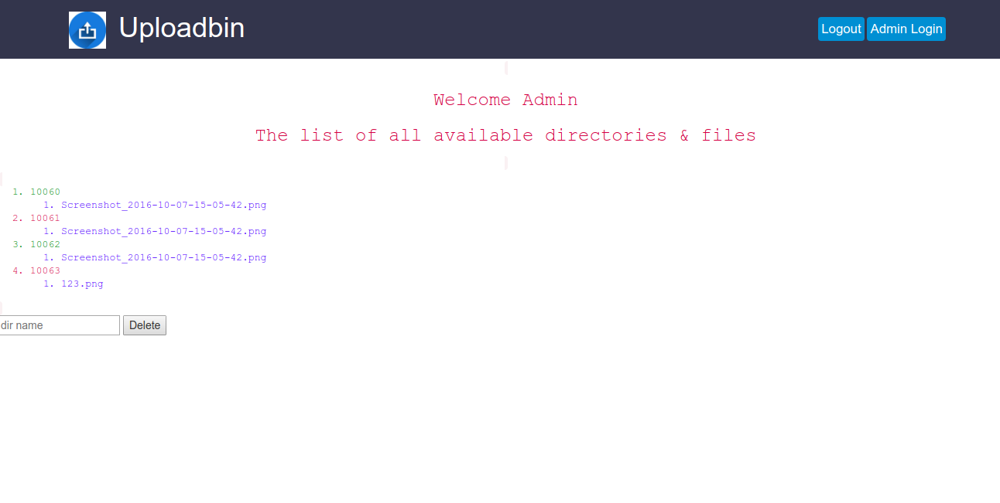

# Uploadbin
You can upload anything upto fixed size.It generates a link for it. You have to paste this link in url and it get downloaded. It is written in PHP with MySQL.
There is Admin panel also where he can delete these files at any time.

## HomePage
Here, you can select any file, document, mp3 or anything upto  sie of 2GB. 

## Link Generation.
Here, link for uploaded file is generated  and you can use this link to download the files amytime. 

## Admin Panel
Here, you can see all the files and you can delete delete these files at any time by searching them.

